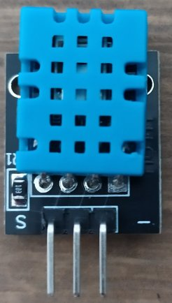

# DHT11 Library for STM32   

> This library is based on STM32 HAL Drivers.

## Hardware

<div style="text-align: center;">
  
</div>

- Signal (S)
- Vcc (3.3V to 5.5V)
- Gnd (-)

## Usage Example

>Tested on STM32F103C8T6 (Blue Pill).

> Timer frequency needs to be set to 1us (htim1 in this example) .

```c
DHT11_t dht11;
DHT11_Begin(&dht11, GPIOC, GPIO_PIN_14, &htim1);
DHT11_Read(&dht11);
float temperature = dht11.temperature;
float humidity = dht11.humidity;
```


